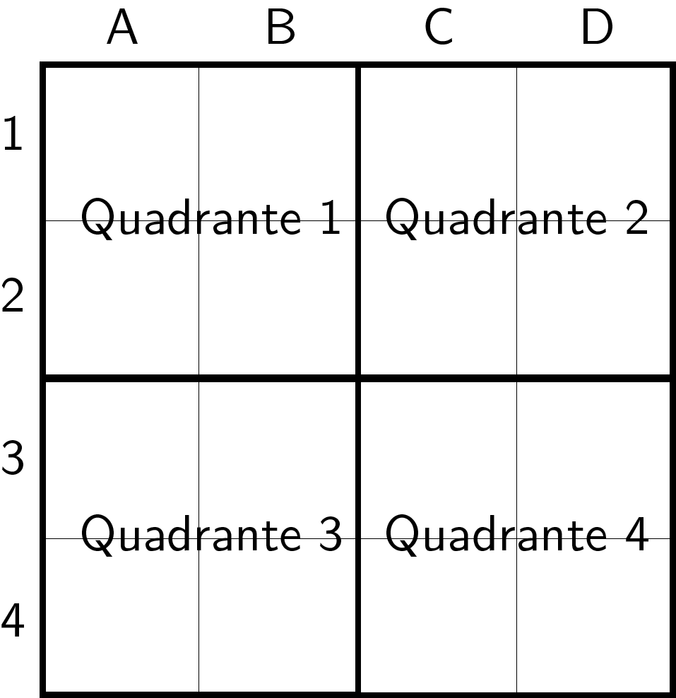
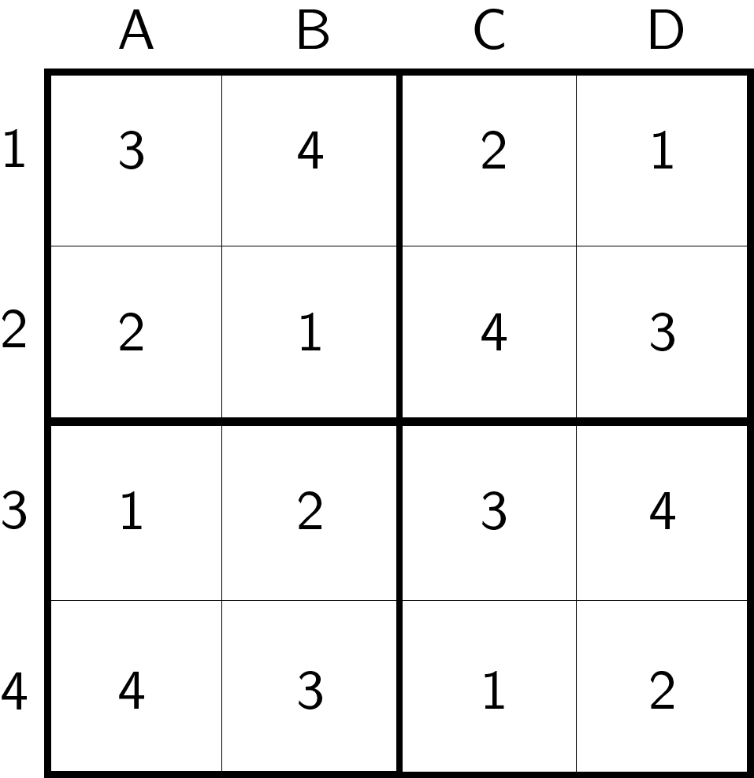
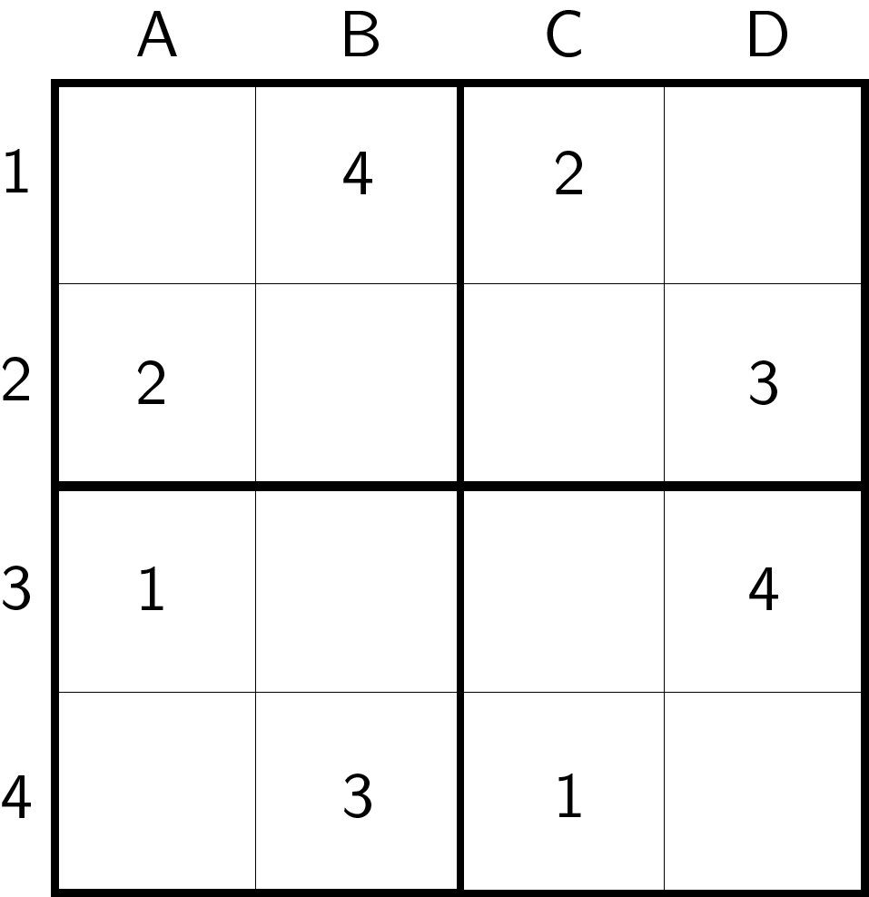

# Algoritmia e Programação 2020 2021 - Exame Final - Parte Prática

- [Algoritmia e Programação 2020 2021 - Exame Final - Parte Prática](#algoritmia-e-programação-2020-2021---exame-final---parte-prática)
  - [Sudoku](#sudoku)
  - [Instruções](#instruções)
    - [**Registar jogador (RJ)**](#registar-jogador-rj)
    - [**Iniciar jogo (IJ)**](#iniciar-jogo-ij)
    - [**Colocar número (CN)**](#colocar-número-cn)
    - [**Consultar jogador (CJ)**](#consultar-jogador-cj)
  - [Tarefas](#tarefas)
  - [Regras](#regras)
    - [Comunicação enviada](#comunicação-enviada)
  - [Entrega](#span-stylecolor-greenentregaspan)

## Sudoku

O Sudoku é um jogo com um jogador, onde é necessário preencher uma grelha, com tamanho $n \times n$, com todos os números inteiros de 1 a $n$.

Cada linha e coluna deve conter todos os números. Um número não pode surgir mais que uma vez numa linha, nem coluna.

A grelha encontra-se dividida em (quatro) quadrantes, definidos pela separação . Cada número deve surgir uma, e só uma vez em cada quadrante.

Neste programa pretende-se suportar apenas grelhas de 4 $\times$ 4.

Cada linha e quadrante são referidos com um número, e cada coluna com uma letra, de acordo com a imagem seguinte.

Segue um exemplo de um jogo válido.

Pretende-se que implemente o jogo de forma a que vários jogadores introduzam jogos imcompletos, e os preencham até obter uma grelha válida.

## Instruções

### **Registar jogador (RJ)**

Regista um novo jogador. Cada jogador tem um nome único, sem espaços. Não existe limite para o número de jogadores registados.

Entrada:

`RJ Nome`

Saída com com sucesso:

`Jogador registado.`

Saída com insucesso:

- No caso de já existir um jogador com o mesmo nome:

    `Ocorreu um erro.`

### **Iniciar jogo (IJ)**

É necessário indicar o nome do participante do jogo e a situação inicial da grelha. O jogador tem que estar previamente registado.

Entrada:

`IJ Nome 1A,1B,1C,1D;2A,2B,2C,2D;3A,3B,3C,3D;4A,4B,4C,4D`

Onde `Nome` indica o nome de um jogador, e as várias posições da grelha indicam os valores iniciais. Se não existir valor, deve ser indicado um zero (`0`).

A indicação de valores iniciais é feita por linha, com os valores separados por vírgulas. As linhas são separadas por ponto e vírgula.

Por exemplo, para iniciar o jogo com a jogadora "Alice", com a seguinte grelha

é necessário indicar

`IJ Alice 0,4,2,0;2,0,0,3;1,0,0,4;0,3,1,0`

Saída com sucesso:

`Jogo iniciado.`

Saída com insucesso:

- No caso do jogador não existir, ou se já existir um jogo em curso:

    `Ocorreu um erro.`

### **Colocar número (CN)**

O jogador deve indicar o o número da linha e letra da coluna onde deseja colocar o número. Um número pode ser colocado numa localização vazia, ou ocupada por outro número, substituindo-o. Não é necessário validar substituições de números iniciais.

Entrada:

`CP Nome Linha Coluna Número`

Saída com sucesso:

- No caso de grelha por terminar ou inválida:

    `Número colocado com sucesso.`

- No caso de grelha totalmente preenchida e válida (deve ser acrescentado um jogo jogado ao jogador, e o jogo em curso deve ser terminado):

    `Jogo terminado.`

Saída com insucesso:

- No caso de não existir um jogo em curso, ou a localização indicada por fora de grelha:

    `Ocorreu um erro.`

### **Consultar jogador (CJ)**

Deve ser possível consultar o número de jogos jogados por um jogador.

Entrada:

`CJ Nome`

Saída com sucesso:

`NúmeroDeJogos`

Saída com insucesso:

- No caso do jogador não existir:

    `Ocorreu um erro.`

## Tarefas

1. (**30%**) Implemente a lógica de interação no módulo `program`.
   - O ficheiro encontra-se vazio, e deve ser escrito na totalidade.
   - Deve apenas tratar da interação com o utilizador. A lógica do jogo está disponível no módulo `sudoku`.
   - A implementação de lógica de jogo no módulo `program` não será considerada na avaliação.
   - Os métodos em `sudoku` têm regras de implementação condicionais ao número de estudante (ver comentários dos métodos). Devem ser utilizados de acordo com essas regras.
2. (**70%**) Implemente as regras do jogo no módulo `sudoku`.
   - O ficheiro encontra-se incompleto. Os nomes das funções não deve ser alterados.
   - As funções devem ser chamadas pelo módulo `program`, mesmo que não sejam implementadas.

   **IMPORTANTE:** A estratégia de implementação destas funções é condicional ao número de aluno (ver secção de [Regras](#regras)). Os detalhes condicionais estão descritos em comentários nas funções do módulo.

## Regras

O número de estudante determina a estratégia de implementação das funções pedidos em `sudoku.py`. A implementação deste módulo deve iniciar com a definição da variável de módulo `number`.

O ficheiro `sudoku.py` contém, na linha 16,

`number = "INDICAR NÚMERO DE ESTUDANTE"`

Assumindo que o número de estudante é `40004242`, a variável deve ser alterada para

`number = "40004242"`

**IMPORTANTE:** A variável `number` é do tipo `string`. Não pode ser declarada com qualquer outro tipo.

O módulo vai capturar o último dígito do número de estudante (no exemplo, `2`), e vai somar `1` (no exemplo, resulta em `3`). O resultado desta operação ficará guardado na variável de módulo `last_digit`. Esta variável vai ser, necessariamente par ou ímpar. O objetivo das várias funções será condicional a esta caraterística.

Exemplos:

| Número   | number       | last_digit | Paridade |
|----------|--------------|------------|----------|
| 30002222 | `"30002222"` | `2+1 = 3`  | Ímpar    |
| 30001000 | `"30001000"` | `0+1 = 1`  | Ímpar    |
| 30001009 | `"30001009"` | `9+1 = 10` | Par      |

É também necessário indicar o número de estudante na variável de módulo `number` (também string) em `program.py`.

### Comunicação enviada

A parte prática do exame vai envolver a escrita de algumas funções. Para a realizar será necessário indicar o número de estudante numa variável, num módulo entregue durante a prova.

Vai ser definida outra variável com o último dígito do número de estudante, somado com 1. O valor resultante será par ou ímpar. Os requisitos de implementação das várias funções serão condicionais a esta caraterística.

Exemplos:

| Número de estudante &nbsp;&nbsp; | &nbsp;&nbsp;Último dígito + 1 | &nbsp;&nbsp;Paridade |
|----------------------------------|-------------------------------|----------------------|
| 30002222                         | &nbsp;&nbsp;`2+1 = 3`         | &nbsp;&nbsp;Ímpar    |
| 30001000                         | &nbsp;&nbsp;`0+1 = 1`         | &nbsp;&nbsp;Ímpar    |
| 30001009                         | &nbsp;&nbsp;`9+1 = 10`        | &nbsp;&nbsp;Par      |

**IMPORTANTE:** Recomenda-se que determine esta paridade antes de iniciar o exame.

---

## Entrega

Devem ser entregues os ficheiros `program.py` e `sudoku.py`, ambos com a variável de módulo `number` definida com o número de estudante.

Os ficheiros devem ser entregues individualmente, com a extensão `.py`, sem recorrer a qualquer tipo de compressão.

---
